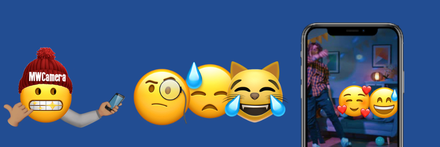

# MWCamera

[](https://travis-ci.org/woodyjl/MWCamera)
[](https://cocoapods.org/pods/MWCamera)
[](https://cocoapods.org/pods/MWCamera)
[](https://cocoapods.org/pods/MWCamera)


```MWCamera``` is a lightweight framework that helps build powerful camera apps for ios! This framework was also inspired by [SwiftyCam](https://github.com/Awalz/SwiftyCam) ✊🏽.


* [Features](#-features)
* [Installation](#-installation)
* [Example](#-example)
* [How to use](#-how-to-use)
* [Documentation](#-documentation)
* [Supported OS & SDK Versions](#-supported-os--sdk-versions)
* [Next steps](#-next-steps)
* [Contributing](#-contributing)
* [Author](#-author)
* [License](#-license)


## 🎙 Features

- [x] Easy to use
- [x] Supports iOS11.2+
- [x] Image capture
- [x] Video capture
- [x] Manual image quality settings
- [x] Front and back camera
- [x] Front and rear flash
- [x] Record while switching cameras
- [x] Capture Image while recording
- [x] manual zoom
- [x] manual focus
- [x] Background audio support
- [x] Fully customizable
- [x] Universal (iPhone & iPad)
- [x] Simple Swift syntax
- [x] Lightweight readable codebase


## 📲 Installation

MWCamera is available through [CocoaPods](https://cocoapods.org). To install
it, simply add the following line to your Podfile:

```ruby
pod 'MWCamera'
```

## 🌚 Example

To run the example project, clone the repo, and run `pod install` from the Example directory first.


## 🤓 How to use

Using MWCamera is very straight forward.

### 🤨📝 Prerequisites

If you didn't know, Apple requires the additon of the `NSCameraUsageDescription` and `NSMicrophoneUsageDescription` keys to the info.plist of your application. Example:

```xml
<key>NSCameraUsageDescription</key>
<string>To Capture Photos and Videos</string>
<key>NSMicrophoneUsageDescription</key>
<string>To Record Audio</string>
```


### 🥳 Getting Started

If you install MWCamera from Cocoapods, be sure to import the module at the top of the file.

```swift
import MWCamera
```


To get started with MWCamera, subclass  `MWCameraViewController`.

```swift
class CameraViewController: MWCameraViewController
```

Then once you handle camera and microphone permissions you can now configure the AVCaptureSession by calling 

```swift
self.reconfigureSession()
```

After this feel free to start adding your own config to to the AVCaptureDevice like 

```swift
if let device = self?.captureDevice {
    do {
        try device.lockForConfiguration()
        if device.isFocusModeSupported(.continuousAutoFocus) {
            device.focusMode = .continuousAutoFocus
        }

        if device.isSmoothAutoFocusSupported {
            device.isSmoothAutoFocusEnabled = true
        }

        if device.isExposureModeSupported(.continuousAutoExposure) {
            device.exposureMode = .continuousAutoExposure
        }

        if device.isWhiteBalanceModeSupported(.continuousAutoWhiteBalance) {
            device.whiteBalanceMode = .continuousAutoWhiteBalance
        }

        if device.isLowLightBoostSupported {
            device.automaticallyEnablesLowLightBoostWhenAvailable = true
        }

        device.unlockForConfiguration()
    } catch {
        print("[mwCamera]: Error locking configuration")
    }
}
```

Then afterwords call

```swift
self.beginSession()
```

And that's all to get your camera session up and running! 💪🏾

Also `self.reconfigureSession()` does not add audio input and output. These are added to the session right before recording then removed right after in order mimic features observed in Snapchat/Instagram. 

To capture media MWCamera has the following functions

```swift
func startRecording() {}

func stopRecording() {}

func cancelRecording() {}

func capturePhoto() {}
```

To be alerted on what's going on set an MWCameraDelegate. For photo capture notifications MWCamera already implements the AVCapturePhotoCaptureDelegate so you can just override those functions. Please make sure to call super in order keep MWCamera functioning correctly.

**One More Thing!**

MWCameraButton is a throw in view that makes setting up an instagram/snapchat camera app even easier. Just three lines:

```swift
let captureButton = MWCameraButton()
self.register(captureButton)
view.addSubview(captureButton)
```

### 📚 Documentation
Coming soon...😅?


### 📋 Supported OS & SDK Versions

* iOS 11.2+
* Swift 4.2+


## 📬 Next steps

* [x] Better documentation
* [ ] Smooth zooming from button
* [ ] Less intruisive and tailorable logs
* [ ] AR Examples like Snap/Insta filters
* [ ] iPadOS support?
* [ ] MacOS support?

## ❤️ Contributing
This is an open source project, so feel free to contribute. How?
- Open an [issue](https://github.com/Woodyjl/MWCamera/issues/new).
- Send feedback via [email](mailto://woodyjeanlouis@fiitbuds.com).
- Propose your own fixes, suggestions and open a pull request with the changes.

See [all contributors](https://github.com/Woodyjl/MWCamera/graphs/contributors)


## 👨🏽‍💻 Author

woodyjl, woodyjeanlouis@fiitbuds.com


## 👮🏾‍♀️ License

```
MIT License

Copyright (c) 2019 woodyjl <woodyjeanlouis@gmail.com>

Permission is hereby granted, free of charge, to any person obtaining a copy
of this software and associated documentation files (the "Software"), to deal
in the Software without restriction, including without limitation the rights
to use, copy, modify, merge, publish, distribute, sublicense, and/or sell
copies of the Software, and to permit persons to whom the Software is
furnished to do so, subject to the following conditions:

The above copyright notice and this permission notice shall be included in all
copies or substantial portions of the Software.

THE SOFTWARE IS PROVIDED "AS IS", WITHOUT WARRANTY OF ANY KIND, EXPRESS OR
IMPLIED, INCLUDING BUT NOT LIMITED TO THE WARRANTIES OF MERCHANTABILITY,
FITNESS FOR A PARTICULAR PURPOSE AND NONINFRINGEMENT. IN NO EVENT SHALL THE
AUTHORS OR COPYRIGHT HOLDERS BE LIABLE FOR ANY CLAIM, DAMAGES OR OTHER
LIABILITY, WHETHER IN AN ACTION OF CONTRACT, TORT OR OTHERWISE, ARISING FROM,
OUT OF OR IN CONNECTION WITH THE SOFTWARE OR THE USE OR OTHER DEALINGS IN THE
SOFTWARE.
```
MWCamera is available under the MIT license. See the LICENSE file for more info.
